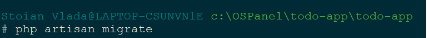
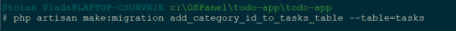
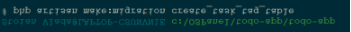
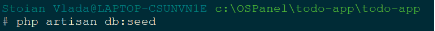

UNIVERSITATEA DE STAT DIN MOLDOVA

FACULTATEA „MATEMATICĂ ŞI INFORMATICĂ”

DEPARTAMENTUL“INFORMATICĂ APLICATA”

Framework
# Lucrare de laborator nr. 3.
**Bazele lucrului cu baze de date în Laravel**

`                                `Realizat : Stoian Vladimira

`                              `Grupa: IA2201

`                                `Verificat: Nichita Nartea

Chişinău 2024
## **Condiții:**
### ***1. Pregătirea pentru lucru***
1.3. *Configurați variabilele de mediu în fișierul .env pentru a vă conecta la baza de date:*

### ***2. Crearea modelelor și migrațiilor*** 
2.1. *Creez modelul Category împreună cu migrarea aferentă:*

2.2. *Definirea structurii tabelei category în migrație:*

Dupa modul cum am creat modelul Category, creez exact asa  modelul Task si modelul Tag împreună cu migrarea aferentă.

2.3. ***Creați modelul Task — sarcina.***

2.4. ***Definirea structurii tabelei task în migrație:***

2.5. ***Creați modelul Tag — sarcina.***

2.6. ***Definirea structurii tabelei tag în migrație:***

2.7. ***Rulați migrarea pentru a crea tabelele în baza de date***

2.8. ***Adăugați câmpul $fillable în modelele Task, Category și Tag pentru a permite atribuirea în masă a datelor.***

**Pentru Category:**

![ref1]

**Pentru Taks:**

![ref2]

**Pentru Tags:**

### ***3. Relația dintre tabele***
#### ***3.1. Creați o migrare pentru a adăuga câmpul category\_id în tabela task.***

***3.1.1 În modelul Category, adaugă relația cu Task:***

![ref3]

***3.1.2 În modelul Task, adaugă relația cu Category:***

![ref4]
#### ***3.2. Creați o tabelă intermediară pentru relația de tipul multe-la-multe dintre sarcini și etichete:***

 

***3.2.1 Adaug relația multe-la-multe in Taks si Tag:***

***3.3 Definirea structurii corespunzătoare a tabelei în migrație.***

***3.3.1 migrația pentru tabelul intermediar task\_tag:***

***3.3.2** Actualizează fișierul de migrare **pentru a defini structura tabelei task\_tag:***

În acest fișier:

- foreignId('task\_id')->constrained('tasks')->onDelete('cascade') creează un câmp task\_id cu o cheie externă care se referă la coloana id din tabela tasks. onDelete('cascade') asigură că, dacă un task este șters, înregistrările corespunzătoare din task\_tag sunt de asemenea șterse.
- foreignId('tag\_id')->constrained('tags')->onDelete('cascade') creează un câmp tag\_id cu o cheie externă care se referă la coloana id din tabela tags, cu același comportament de ștergere în cascadă.

***3.4  Rulați migrarea pentru a crea tabela în baza de date.***

***4. Relațiile dintre modele***

***4.1. Adăugați relații în modelul Category, adaugă metoda tasks pentru a indica relația de tipul „o categorie poate avea multe sarcini”:***

***4.2. Adăugați relații în modelul Task***

***4.3** Relația în modelul **Tag***

**Rezumat:**

- Category are o relație hasMany cu Task, ceea ce înseamnă că o categorie poate avea mai multe sarcini.
- Task are o relație belongsTo cu Category, deoarece o sarcină aparține unei categorii.
- Task are o relație belongsToMany cu Tag prin tabela intermediară task\_tag, permițând asocierea de etichete multiple pentru o sarcină.
- Tag are o relație belongsToMany cu Task, deoarece o etichetă poate fi legată de mai multe sarcini.

***5.Crearea fabricilor și seed-urilor***

***5.1 Creați o fabrică pentru modelul Category***

***5.2 Creați o fabrică pentru modelul Task***

***5.3 Creați o fabrică pentru modelul Tag***

***5.4 Creați seed-uri pentru a popula tabelele cu date inițiale pentru modelele Category, Task, Tag***

Creează seed-uri în fișierul DatabaseSeeder.php

**Category Seeder:**

**Taks Seeder:**

**Tag Seeder:**

***5.5 Actualizați fișierul DatabaseSeeder pentru a lansa seed-urile și rulați-le:***

***6.*** ***Lucrul cu controlere și vizualizări***

1. Deschideți controlerul TaskController (app/Http/Controllers/TaskController.php).
1. Actualizați metoda index pentru a obține lista sarcinilor din baza de date.
   1. Folosiți modelul Task pentru a obține toate sarcinile.
1. Actualizați metoda show pentru a afișa o sarcină individuală.
   1. Afișați informațiile despre sarcină după identificatorul acesteia.
   1. **Obligatoriu** afișați categoria și etichetele sarcinii.
1. În metodele index și show, folosiți metoda with (**Eager Loading**) pentru a încărca modelele asociate.
1. Actualizați vizualizările corespunzătoare pentru a afișa lista de sarcini și o sarcină individuală.
1. Actualizați metoda create pentru a afișa formularul de creare a unei sarcini și metoda store pentru a salva o sarcină nouă în baza de date.
   1. **Notă**: Deoarece nu ați studiat încă formularele, folosiți obiectul Request pentru a obține datele. **De exemplu**:
   1. $request->input('title');*// sau*  $request->all();
1. Actualizați metoda edit pentru a afișa formularul de editare a unei sarcini și metoda update pentru a salva modificările în baza de date. 
1. Actualizați metoda destroy pentru a șterge o sarcină din baza de date.

   Toate conditile de mai sus le voi plasa intr-un screen:

   

   

   

   

   

   În vizualizarea index.blade.php, afișează lista de sarcini:

   

   În vizualizarea show.blade.php, afișează detaliile unei sarcini:

   

   **Întrebări de control**

1. **Ce sunt migrațiile și la ce se folosesc?**

Migrațiile sunt un instrument important pentru dezvoltatori în menținerea bazei de date pe parcursul unui proiect de dezvoltare. Acestea reprezintă fișiere de definiții ale structurii tabelelor și ale modificărilor, care, prin cod, permit controlul evoluției bazei de date. Migrațiile sunt utilizate pentru următoarele activități:

- Crearea tabelelor și a relațiilor dintre ele.
- Modificarea/actualizarea structurii existente (adăugarea de coloane, schimbarea tipurilor de date, ștergerea tabelelor).
- Posibilitatea de a furniza baza de date la diferite versiuni sau de a reveni la o versiune anterioară în caz de erori, pentru a asigura consistența între baza de date și cod.
1. **Ce sunt fabricile și seed-urile și cum simplifică procesul de dezvoltare și testare?**

Fabricile sunt șabloane pentru generarea automată a datelor de test, definind cum ar trebui să arate datele de bază pentru un model. Seed-urile sunt scripturi care completează o bază de date cu date predefinite. Fabricile și seed-urile facilitează dezvoltarea și testarea aplicației prin următoarele:

- Generarea rapidă a datelor de test, eliminând necesitatea de a introduce manual informații în baza de date.
- Crearea unui set de date consistent și reproductibil pentru testare, prin care erorile pot fi reproduse și testele sunt precise.
- Simplificarea inițializării unei baze de date pentru noii membri ai echipei de dezvoltare.
1. **Ce este ORM? Care sunt diferențele dintre pattern-urile DataMapper și ActiveRecord?**

Maparea Obiect-Relatională (ORM) este o tehnologie care facilitează interacțiunea între baza de date și codul aplicației. Aceasta permite dezvoltatorilor să manipuleze datele ca obiecte și să scrie interogări SQL directe pentru a interacționa cu baza de date. Un ORM mapează tabelele bazei de date la clasele din codul aplicației și înregistrările din tabele la instanțele acelor clase.

Diferențele între pattern-urile **DataMapper** și **ActiveRecord**:

- **ActiveRecord**: unde un obiect reprezintă o înregistrare din baza de date și conține metode care pot salva, șterge sau încărca acea înregistrare. În cazul ActiveRecord, modelele gestionează atât datele, cât și logica interacțiunii cu baza de date, cum ar fi în Laravel.
- **DataMapper**: decuplează obiectele de logica de persistență. Astfel, obiectele nu știu cum să comunice cu baza de date; această responsabilitate este delegată unui "mapper" care convertește obiectele în interogări și invers. DataMapper este mai complex, dar oferă mai multă flexibilitate și separare a responsabilităților, cum ar fi în Doctrine ORM în PHP.
1. **Care sunt avantajele utilizării unui ORM comparativ cu interogările SQL directe?**

Utilizarea unui ORM are următoarele avantaje:

- **Abstracție la nivelul bazei de date**: Această funcționalitate permite dezvoltatorului să lucreze cu obiecte în loc de interogări SQL, ceea ce face codul mai intuitiv și mai ușor de întreținut.
- **Compatibilitatea între baze de date**: ORMs oferă de obicei posibilitatea de a comuta între diferite tipuri de baze de date cu puține modificări în cod.
- **Securitate**: Folosește interogări parametrizate, prevenind atacurile de tip SQL injection.
- **Automatizare**: Majoritatea funcționalităților CRUD sunt automatizate, iar unele relații între tabele pot fi gestionate folosind metode în loc de scriere manuală a interogărilor.
1. **Ce sunt tranzacțiile și de ce sunt importante în lucrul cu bazele de date?**

Tranzacțiile sunt unități atomice de execuție în baza de date, ceea ce înseamnă că asigură executarea completă a mai multor operațiuni sau anularea lor completă. În cazul unei erori în cadrul unei părți a operațiunilor dintr-o tranzacție, totul este anulat pentru a restaura baza de date într-o stare consistentă. Tranzacțiile sunt esențiale pentru:

- **Consistența datelor**: Previn stările corupte în baza de date în cazul în care una dintre acțiuni eșuează.
- **Gestionarea corectă a concurenței**: Asigură că utilizările concurente ale unei baze de date nu intră în conflict sau nu furnizează date incorecte.
- **Siguranța operațiunilor**: Sunt folosite pentru operațiuni sensibile, cum ar fi tranzacțiile financiare sau modificările importante de date.

[ref1]: Aspose.Words.e6d2be97-9563-4d95-92b9-a30e4f0d7d60.009.png
[ref2]: Aspose.Words.e6d2be97-9563-4d95-92b9-a30e4f0d7d60.010.png
[ref3]: Aspose.Words.e6d2be97-9563-4d95-92b9-a30e4f0d7d60.014.png
[ref4]: Aspose.Words.e6d2be97-9563-4d95-92b9-a30e4f0d7d60.015.png
